[toc]

# Java基础总结

## 第一章 基础知识

### Java体系的技术被划分为三大块

- ​	JavaSE：标准版

- ​	JavaEE：企业版

- ​	JavaME：微型版

  

### 安装JDK之后：

- JDK：Java开发工具箱
- JRE：Java运行环境
- JVM：Java虚拟机

### Java程序编译后可以在不同平台之间运行:跨平台性

放源代码的扩展名必须是.java

编译生成的字节码文件扩展名是.class

1个java源文件可以编译生成多个class文件

字节码文件不是二进制，不然不用虚拟机解释，直接操作系统就执行了

### Java程序从开发到最终运行经历了什么?

编译期:(可以在windows 上)

- 第一步:在硬盘的某个位置（随意），新建一个xxx.java文件
- 第二步:使用记事本或者其它文本编辑器例如EditPlus打开xxx.java文件
- 第三步:在xxx.java文件中编写"符合java语法规则的n源代码
- 第四步:保存（(一定要将xxx.java文件保存一下)
- 第五步:使用编译器(javac【JDK安装后自带】）对xxx.java文件进行编译。
- 第六步:如果xxx.java文件中编写的源代码是符合语法规则的，编译会通过，如果xxx.java文件中编写的源代码违背了语法规则，那么编译器会报错，编译器报错之后class文件是不会生成的，只有编译通过了才会生成class字节码文件。并且一个java源文件是可以生成多个class文件的。（编译实质上是检查语法)

运行期（)(可以在windows上，也可以在其他的os上。)

- 第七步:如果是在Linux上运行，需要将windows上生成的class文件拷贝过去不需要拷贝源代码，真正运行的是字节码。(但是源代码也不要删除，有用)
- 第八步:使用DK自带的一个命令/工具: java（负责运行的命令/工具）执行字节石
- 第九步:往下的步骤就全部交给JM了，就不需要程序员干涉了。
- JVM会将字节码文件装载进去，然后JVM对字节码进行解释（解释器负责将字节码解释为1010101010..等的二进制)
- 第十步:JVM会将生成的二进制码交给os操作系统，操作系统会执行二进制码和破硬件进行交互。

javac命令，负责编译

java命令，负责运行

### 环境配置

用户变量：只有当前用户可以用

系统变量：整个系统的用户都可以用

修改Path环境变量路径


javac java源文件的路径

java 类名

### 运行java步骤

1. cd命令切换到class文件所在目录
2. 执行java Test，java后面只能跟类名

classpath是给类加载器指路的，默认情况下classloader会从当前路径找，配置classpath之后类加载器只会在配置的目录中寻找，不会再从当前的路径中寻找了


### 标识符

数字、字母、下划线_、美元符号组成不能含有其他符号，不能以数字开头，不能有空格，关键字不能作为标识符

### 命名规范

1. 英语单词
2. 驼峰
3. 类名、接口名首字母大写，后面每个单词首字母大写
4. 变量名首字母小写，后面每个单词首字母大写
5. 所有常量全部大写，单词与单词之间采用下划线衔接
6. Java语言中严格区分大小写

## 第二章 Java基本的程序设计结构

### 数据类型

byte 1字节

short  2

int  4

long  8

float 4

double 8 

boolen  1

char  2 可以存储一个汉字

引用数据类型

#### 1 转义字符

```java
public class Test {
    public static void main(String[] args) {
        //转义字符输出单引号,\'表示一个单引号
        System.out.println('\'');
        //输出\
        System.out.println('\\');
        //输出""
        System.out.println("\"test\"");
        System.out.println("'");
        //\u表示字符的Unicode编码
        char x = '\u4e2d';
        System.out.println(x);
    }
}
```

#### 2 类型转化

1、boolean不能参与类型转换，其它都行。

2、没有超出byte short char的范围,整数可以直接赋值。、

3、自动类型转换小--->大

4、byte < short(char) <int < long < float < double4、强制类型转换大-->小需要加强制类型转换符

5、 byte short char混合运算,先各自转换成int，再做运算

6、多种数据类型混合运算的时候，各自先转换成容量最大的哪一种再做运算。

java中整数默认是int型，long需要在数字后面加L

浮点数默认是double，float后面要加F

精度损失不超过范围可以直接赋值成short byte

```java
/*
    小容量可以直接赋值给大容量，成为自动类型转换
    大容量转换成小容量必须加上强制类型转换符
 */
public class Test {
    public static void main(String[] args) {
        long x = 100L;
        int y = (int)x;
    }
}
```

```java
/*
    整数没有超过范围可以直接赋值给char
 */
public class Test {
    public static void main(String[] args) {
        char c = 97;
        System.out.println(c);  //output:a
    }
}
```

#### 3 混合运算

```java
/*
    byte char short 做混合运算时，先各自转换成int再做运算
 */
public class Test {
    public static void main(String[] args) {
        char c = 'a';
        byte b = 1;
        System.out.println(c+b);  //output:98
        //short s = c + b;  错误，编译器不知道加法结果有没有超过short范围，只知道右边结果是int
        /*int a = 1;错误
        short x = a;*/
    }
}
```

多种数据类型混合运算最终的结果是最大容量对应的类型，除byte char short会变成int

### 运算符

a++ 先执行表达式再自增

++a 先自增再执行表达式

使用扩展运算符不会改变

 

```java
public class Test {
    public static void main(String[] args) {
       byte x = 100;
       x = x+1; //报错
       x += 1;  //正确
    }
}
```

三目运算符

```java
public class Test {
    public static void main(String[] args) {
       int a = 5,b = 6;
       boolean flag = a > b? true:false;
       System.out.println(flag);
    }
}
```


```java
/*
* + 运算符
* 1.求和2.字符串拼接
* 两边都是数字的时候求和
* 任意一方是字符串类型字符串拼接
* */
public class Test {
    public static void main(String[] args) {
      int old = 35;
      System.out.println("年龄=" + 35);
      int a = 100;
      int b = 200;
      //多个加号自左向右依次进行，除非有小括号
      System.out.println(a+b+"110");    //output 300110
    }
}
```

### 用户输入

```java
import java.util.Scanner; // 导入 Scanner 类
public class Main {
 public static void main(String[] args) {
  Scanner myObj = new Scanner(System.in); // 创建 Scanner 对象
  System.out.println("Enter username");
  String userName = myObj.nextLine(); // 读取用户输入
  System.out.println("Username is: " + userName); // 输出用户输入
 }
}
```

| 方法          | 描述                         |
| ------------- | ---------------------------- |
| nextBoolean() | 从用户处读取 boolean 布尔值  |
| nextByte()    | 从用户处读取 byte 字节       |
| nextDouble()  | 从用户处读取 double 双精度值 |
| nextFloat()   | 从用户处读取 float 浮点值    |
| nextInt()     | 从用户处读取一个 int 值      |
| nextLine()    | 从用户处读取 String 字符串值 |
| nextLong()    | 从用户处读取 long 长整形     |
| nextShort()   | 从用户处读取 short 短整形    |

### 控制语句

#### if

```java
import java.util.Scanner;
public class Test {
    public static void main(String[] args) {
        Scanner sc = new Scanner(System.in);
        String out;
        int old = sc.nextInt();
        if(0 <= old && old <= 5) {
            out = "婴幼儿";
        }
        else if (6 <= old && old <= 10 ) {
            out = "少儿";
        }
        else if (11 <= old && old <= 18) {
            out = "少年";
        }
        else if (19 <= old && old <= 35) {
            out = "青年";
        }
        else if (36 <= old && old <= 55) {
            out = "中";
        }
        else if (56 <= old && old <= 150) {
            out = "老年";
        }
        else {
            out = "输入年龄非法";
        }
        System.out.println(out);
    }
}
```

#### switch

switch支持int和Sting类型

```java
import java.util.Scanner;
public class Test {
    public static void main(String[] args) {
        Scanner sc = new Scanner(System.in);
        int old = sc.nextInt();
        switch (old) {
            case 0:
                System.out.println(0);
                break;
            case 1:
                System.out.println(1);
                break;
            default:
                System.out.println("其他");
        }
    }
}
```

#### for

```
import java.util.Scanner;
public class Test {
    //99乘法表
    public static void main(String[] args) {
        for (int i = 1;i <= 9;i++) {
            for (int j = 1;j <= i;j++) {
                System.out.print(j+"*"+i+"="+(i*j)+" ");
            }
            System.out.println();
        }
    }
}
```

#### while

#### do while

```java
import java.util.Scanner;
public class Test {
    //99乘法表
    public static void main(String[] args) {
        int i = 0;
        do {
            i += 1;
            System.out.println(i);
        }while(i <= 10);	//注意分号
    }
}
```

#### break

终结最近循环

#### continue

## 第三章 面向对象

### 1 方法

```java
import java.util.Scanner;
public class Test {
    public static void main(String[] args) {
        sumInt(100,200);
    }
    public static void sumInt(int x,int y) {
        int z = x + y;
        System.out.println(x + " + " + y + " = " + z);
    }
}
```

#### JVM

##### 堆区

  堆是一个运行时数据区，专门用来保存类(class)的实例(instance)并分配空间，不存放基本类型和对象引用，例如new 创建的实例和数组，实际上只是保存实例的属字面量、类型和类型标记等，然而并不保存实例的方法（方法是指令，保存在下一节介绍的栈中）。

  jvm只有一个堆区，它被所有线程共享。堆的大小是由垃圾收集器来负责的，优势是可以动态地分配内存大小，生命周期也不必事先告诉编译器，因为它是在运行时动态分配内存的，垃圾收集器会自动收走不再使用的数据。缺点是由于要在运行时动态分配内存，所以，存取速度较慢。

##### 栈区

  每个线程包含一个栈区，栈中只保存基础数据类型变量的字面量和自定义对象的引用(不是对象)，对象都存放在堆区中。

  每个栈中的数据(基本类型和对象引用)都是私有的，其它栈不能访问。栈分为3个部分：基本类型变量区、执行环境上下文、操作指令区(存放操作指令)。

##### 方法区

  方法区又叫静态区，跟堆一样，被所有的线程共享。它存储的都是在整个程序中永远唯一的元素，如class和static变量。全局变量和静态成员变量的存储是放在一块的，但是，初始化和未初始化的分别存储在相邻的两块区域。

  虚拟机的体系结构包括堆、方法区、本地方法栈和pc寄存器。而方法区保存的就是一个类的模板，堆是放类的实例的，一般来用于函数计算，它里面的数据在函数执行完时是不会存储的，直接丢弃。这就是为什么局部变量每一次都是一样的，即便修改了它后，下次执行函数的时候还是原来的值。

  如果栈内存或者堆内存不足都会抛出异常：

- 栈空间不足：java.lang.StackOverFlowError。
- 堆空间不足：java.lang.OutOfMemoryError。

  栈的空间大小远远小于堆的。栈空间操作起来最快但是空间很小，通常大量的对象都是放在堆空间，理论上整个内存没有被其它进程使用的空间甚至硬盘上的虚拟内存都可以被当成堆空间来使用。

#### 方法重载(overload)

```java
import java.util.Scanner;
public class Test {
    public static void main(String[] args) {
        sum(1,2);
        sum(5l,6l);
        sum(2.1,3.1);
    }
    public static int sum(int x,int y) {
        int z = x + y;
        System.out.println("int sum");
        return z;
    }
    public static long sum(long x,long y) {
        System.out.println("long sum");
        return x+y;
    }
    public static double sum(double x,double y) {
        System.out.println("double sum");
        return x+y;
    }
}
```

什么时候考虑方法重载？两个方法的功能相似

重载条件

1.在同一个类中

2.方法名相同

3.参数类表不同（参数个数，类型，顺序）

方法重载与返回值类型修饰符无关


#### 递归

```java
import java.util.Scanner;
public class Test {
    public static void main(String[] args) {
        Scanner obj = new Scanner(System.in);
        int n = obj.nextInt();
        System.out.println(sum(n));
        System.out.println(sum1(n));
    }
    public static int  sum(int n) {
        //for循环计算1-n的和
        int s = 0;
        for (int i = 1;i <= n;i++) {
            s += i;
        }
        return s;
    }
    public static int sum1(int n) {
        //使用递归计算1-n的和
        if(n == 1) {
            return 1;
        }
        return n + sum1(n-1);
    }
}
```

```java
import java.util.Scanner;
public class Test {
    public static void main(String[] args) {
        Scanner obj = new Scanner(System.in);
        int n = obj.nextInt();
        System.out.println(fun(n));
    }
    //求1-n的阶乘   5*4*3*2*1
   public static int fun(int n) {
        if (n == 1) {
            return n;
        }
        return n*fun(n-1);
   }
}
```

### 2 面向对象

#### 类、对象介绍

三大特征：封装，继承，多态

对象（实例）


##### 构造方法

1.修饰符统一写public

2.构造方法名和类名必须一致

3.构造方法没有返回值类型

当一个类中没有提供任何构造方法，系统默认提供一个无参数的构造方法。缺省构造器

当一个类中手动提供了构造方法，系统不再提供无参构造方法。

```java
public class Student {
    int number;
    String name;
    int age;
    Student() {}
    Student(int nu,String na,int ag) {
        nu = number;
        na = name;
        ag =  age;
    }
}
import java.util.Scanner;
public class Test {
    public static void main(String[] args) {
        Student s1 = new Student(1,"2",3);
        
    }

}
```

##### static

静态变量，可以通过类名访问

```java
public class Student {
    private int number;
    private String name;
    private int age;
    static String kk = "信了";    //静态变量，类级别的
    Student() {}
    Student(int nu,String na,int ag) {
        nu = number;
        na = name;
        ag =  age;
    }

    public int getNumber() {
        return number;
    }

    public void setNumber(int number) {
        this.number = number;
    }

    public String getName() {
        return name;
    }

    public void setName(String name) {
        this.name = name;
    }

    public int getAge() {
        return age;
    }

    public void setAge(int age) {
        this.age = age;
    }
}
import java.util.Scanner;
public class Test {
    public static void main(String[] args) {
        Student s1 = new Student(1,"2",3);
        System.out.println(Student.kk);
    }

}
```

静态方法

方法中直接访问了实例变量，该方法一定是实例方法

如果是工具类，该工具类当中的方法一定是静态的

静态代码块

```java
import java.util.Scanner;
public class Test {
    //静态代码块在类加载时执行，并且在main方法执行之前执行
    //静态代码块可以自上至下顺序执行
    //作用：类加载时记录类加载时的日志信息，写到静态代码块中。
    //静态代码块和静态变量都在类加载时执行，时间相同，只能靠代码顺序来决定谁先谁后
    
    static {    //一个类中可以有多个静态代码块
        System.out.println("A");
        //System.out.println(a);    错误，非法前向引用
    }
    //static int a = 5;
    static {    //一个类中可以有多个静态代码块
        System.out.println("b");
    }
    public static void main(String[] args) {
        System.out.println("main");

    }
    static {    //一个类中可以有多个静态代码块
        System.out.println("c");
    }
}
```

##### 实例语句块

```
只要构造方法执行，必然在构造方法执行之前，自动执行“实例语句块”中的代码
对象构造时机
```

##### 继承

```java
extends
```

Java只允许单继承，不允许继承多个父类

子类继承父类，除构造方法不能继承之外，剩下的都可以继承，但是私有属性无法在子类中直接访问。

所有类默认继承Object类

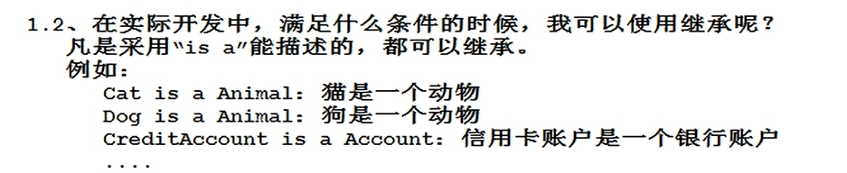

##### toStirng(Object类中方法)

打印类信息（重写父类方法）

```java
public String toString() {
	return getClass().getName()+"@"+Integer.toHexString(hashCode()); 
}
```

```java
import java.util.Scanner;

public class Test {
    public static void main(String[] args) {
        Product p = new Product();
        System.out.println(p.toString());   //out:Product@4554617c
        System.out.println(p);  ////out:Product@4554617c
    }
}

class Product {

}
```

```java
import java.util.Scanner;

public class Test {
    public static void main(String[] args) {
        MyDate m = new MyDate();
        System.out.println(m.toString());
    }
}
class MyDate {
    private int year;
    private int month;
    private int day;
    public MyDate () {
        this(1970,1,1);
    }
    public MyDate(int year, int month, int day) {
        this.year = year;
        this.month = month;
        this.day = day;
    }

    @Override
    public String toString() {
        return "MyDate{" +
                "year=" + year +
                ", month=" + month +
                ", day=" + day +
                '}';
    }

    public int getYear() {
        return year;
    }

    public void setYear(int year) {
        this.year = year;
    }

    public int getMonth() {
        return month;
    }

    public void setMonth(int month) {
        this.month = month;
    }

    public int getDay() {
        return day;
    }

    public void setDay(int day) {
        this.day = day;
    }
}
```

##### 方法覆盖Overrige

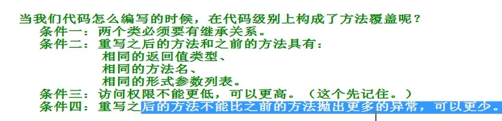

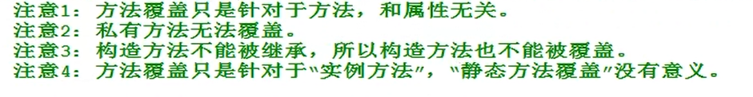

```java
import java.util.Scanner;

public class Test {
    public static void main(String[] args) {
        Cat c = new Cat();
        c.move();
    }
}

class Animal {
    public void move() {
        System.out.println("动物在移动");
    }
}
class Cat extends Animal {
    @Override
    public void move() {
        System.out.println("猫在移动");
    }
}
```

```java
import java.util.Scanner;

public class Test {
    public static void main(String[] args) {
        Chinese c = new Chinese();
        c.setName("张三");
        c.speak();
        American a = new American();
        a.setName("李四");
        a.speak();
    }
}

class  People {
    private String name;
    People() {}
    public People(String name) {
        this.name = name;
    }

    public String getName() {
        return name;
    }

    public void setName(String name) {
        this.name = name;
    }
    public void speak() {
        System.out.println(name + "...");
    }
}
class Chinese extends People {
    @Override
    public void speak() {
        System.out.println(this.getName() + "讲汉语");
    }
}
class American extends People {
    @Override
    public void speak() {
        System.out.println(this.getName() + "讲英语");
    }
}
```

##### 多态

多态指的是父类型引用指向子类型对象

包括编译阶段和运行阶段。

编译阶段：绑定父类的方法

运行阶段：动态绑定子类对象

作用：降低程序耦合度，提高程序扩展力

###### 向上转型和向下转型

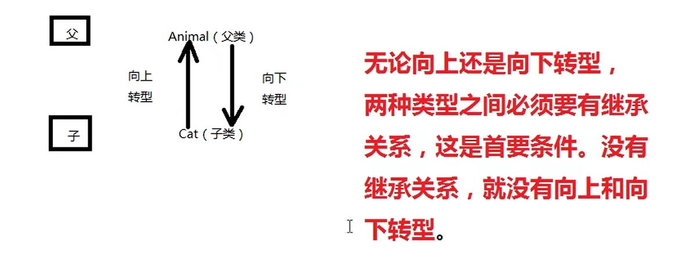

###### 向下转型风险

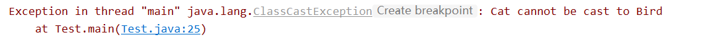

###### 避免：instanceof

任何时候向下转型的时候都要进行instanceof

1.运行阶段动态判断引用指向的对象类型

2.结果只能是:true/false

c是一个引用，c变量保存了内存地址，指向了堆中的对象

假设（c instanceof Cat）为ture表示：

​	c引用指向内存堆中的java对象是一个cat

假设（c instanceof Cat）为false表示：

​	c引用指向内存堆中的java对象不是一个cat

```java
import java.util.Scanner;

public class Test {
    public static void main(String[] args) {
        //普通
        Animal a = new Animal();
        a.move();
        Cat c = new Cat();
        c.move();
        Bird b = new Bird();
        b.move();
        //向上转型 子——》父
        //无论向上转型还是向下转型，两种类型之间必须得有继承关系
        Animal a1 = new Cat();
        a1.move();
        //a1.catFun();  //报错，编译不通过，animal里面没有catFun方法,解决：向下转型
        Animal a2 = new Bird();
        a2.move();
        //向下类型转换 父——》子，当你的方法只有子类中有的时候
        Animal a3 = new Cat();
        Cat x = (Cat)a3;
        x.catFun();
        //java.lang.ClassCastException:类型转换异常
        Animal a4 = new Cat();
        /*Bird y = (Bird)a4;
        y.birdFun();*/
        if (a4 instanceof Bird) {
            Bird y = (Bird)a4;
            y.birdFun();
        }
    }
}

class Animal {
    public void move() {
        System.out.println("动物在移动");
    }
}
class Cat extends Animal {
    @Override
    public void move() {
        System.out.println("猫在移动");
    }
    public void catFun() {
        System.out.println("猫抓老鼠");
    }
}
class Bird extends Animal {
    @Override
    public void move() {
        System.out.println("鸟在移动");
    }
    public void birdFun() {
        System.out.println("鸟吃重紫");
    }
}
```

```java
import java.util.Scanner;

public class Test {
    public static void main(String[] args) {
       Animal x = new Bird();
       Animal y = new Cat();
       if(x instanceof Bird) {
           Bird b = (Bird) x;
           b.birdFun();
       } else if(x instanceof Cat) {
           Cat c = (Cat)x;
           c.catFun();
       }
    }
}

class Animal {
    public void move() {
        System.out.println("动物在移动");
    }
}
class Cat extends Animal {
    @Override
    public void move() {
        System.out.println("猫在移动");
    }
    public void catFun() {
        System.out.println("猫抓老鼠");
    }
}
class Bird extends Animal {
    @Override
    public void move() {
        System.out.println("鸟在移动");
    }
    public void birdFun() {
        System.out.println("鸟吃重紫");
    }
}

```

软件开发七大原则

开闭原则：对扩展开放，对修改减少

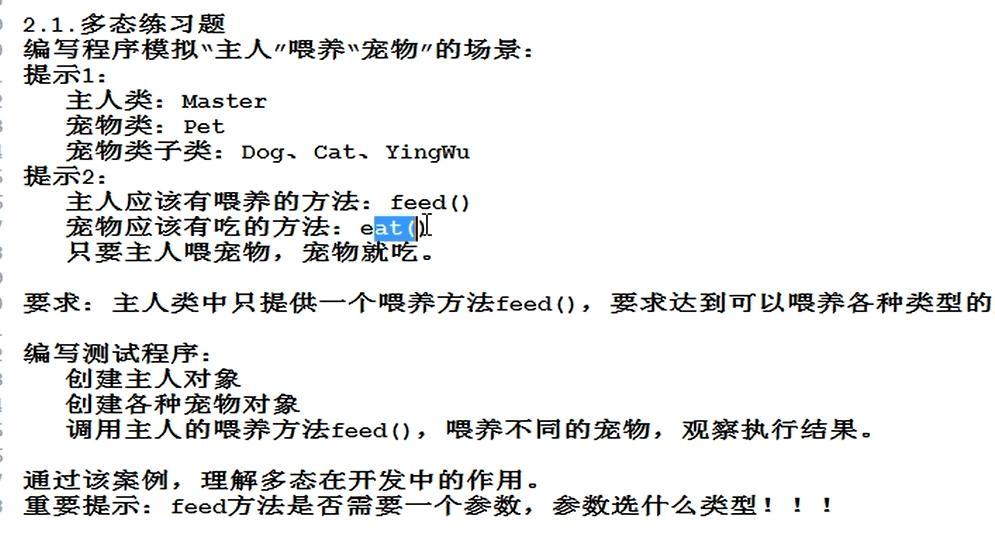

```java
import java.util.Scanner;


public class Test {
    public static void main(String[] args) {
        Master m = new Master();
        Pet p1 = new Dog();
        m.feed(p1);
        Pet p2 = new Cat();
        m.feed(p2);
    }
}

class Master {
    public void feed (Pet p) {
        p.eat();
    }
}
class Pet {
    public void eat() {
        System.out.println("吃");
    }
}
class Dog extends Pet {
    @Override
    public void eat() {
        System.out.println("狗狗吃了");
    }
}
class Cat extends Pet {
    @Override
    public void eat() {
        System.out.println("猫吃了");
    }
}
class Parrot extends Pet {
    @Override
    public void eat() {
        System.out.println("鹦鹉吃了");
    }
}
```

##### super

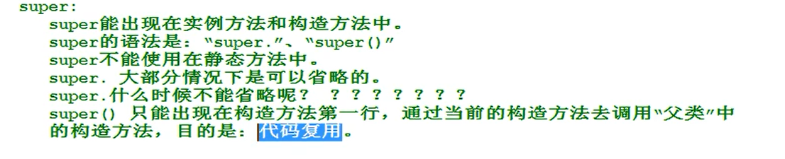

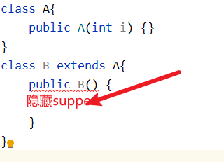

当一个构造方法第一行既没有this()有没有super(),默认会有一个super()

子类构造方法执行时必然会调用父类执行方法

this()和super()不能共存，他们只能在构造函数第一行

```java
import java.util.Scanner;


public class Test {
    public static void main(String[] args) {

    }
}

class A{
    public A(int i) {}
}
class B extends A{
    public B() {
        super(123); //调用父类构造方法
    }
}
```

super内存图

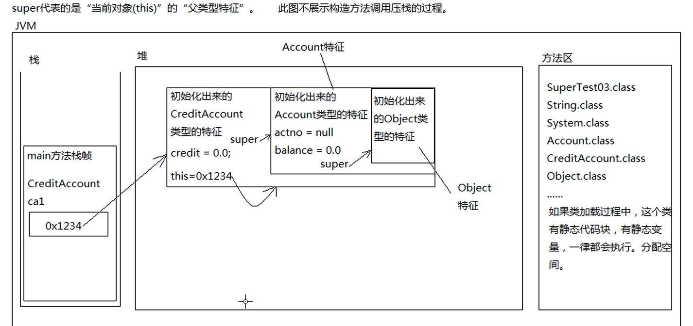

super什么时候不能省略？

子类中有重名属性

super后面必须有.

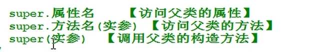

# JavaSE进阶

## 1 IDEA

快捷：

1.sout生成System.out.println

2.删除一行：ctrl+y

3.切换文件：Alt+左箭头或右箭头

## 2 final

1.final修饰的类无法被继承

2.final修饰的方法无法被覆盖，继承

3.final修饰的变量不能重新赋值

final修饰引用

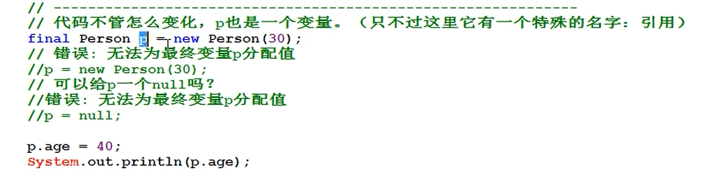

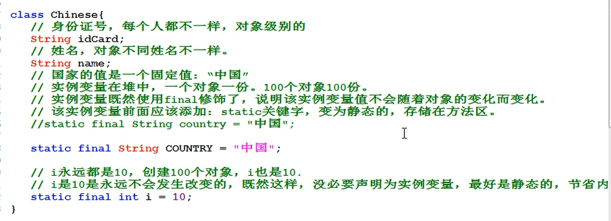

常量：static final联合修饰的变量称为常量

## 3 抽象类

类和类之间共同具有的特征，将这些共同特征提取出来，形成的就是抽象类

抽象类无法创建对象

抽象类也属于引用数据类型

抽象方法：没有实现的方法

抽象类中不一定有抽象方法，抽象方法必须在抽象类中

非抽象类继承抽象类必须将抽象方法实现

```java
import java.util.Scanner;


public class Test {
    public static void main(String[] args) {
        Master m = new Master();
        Pet p1 = new Dog();	//面向抽象编程
        m.feed(p1);
        Pet p2 = new Cat();
        m.feed(p2);
    }
}

class Master {
    public void feed (Pet p) {
        p.eat();
    }
}
abstract class Pet {
    public abstract void eat();
}
class Dog extends Pet {
    @Override
    public void eat() {
        System.out.println("狗狗吃了");
    }
}
class Cat extends Pet {
    @Override
    public void eat() {
        System.out.println("猫吃了");
    }
}
class Parrot extends Pet {
    @Override
    public void eat() {
        System.out.println("鹦鹉吃了");
    }
}
```

## 4 接口（interface）

接口支持多继承

接口中只包含常量和抽象方法

接口中所有元素都是public修饰的，抽象方法定义时public abstract可以省略

接口中的常量public static final可以省略

实现：implements

非抽象类继承接口时必须将接口中的方法全部重写

```java
import java.util.Scanner;


public class Test {
    public static void main(String[] args) {
        Master m = new Master();
        Pet p1 = new Dog();
        m.feed(p1);
        Pet p2 = new Cat();
        m.feed(p2);
    }
}

class Master {
    public void feed (Pet p) {
        p.eat();
    }
}
interface  Pet {
    void eat();
}
class Dog implements Pet {
    @Override
    public void eat() {
        System.out.println("狗狗吃了");
    }
}
class Cat implements Pet {
    @Override
    public void eat() {
        System.out.println("猫吃了");
    }
}
class Parrot implements Pet {
    @Override
    public void eat() {
        System.out.println("鹦鹉吃了");
    }
}
```

继承接口都存在时：extends在前，implements在后

```java
class Dog extends Animal implements Pet {
    @Override
    public void eat() {
        System.out.println("狗狗吃了");
    }
}
```

类之间关系

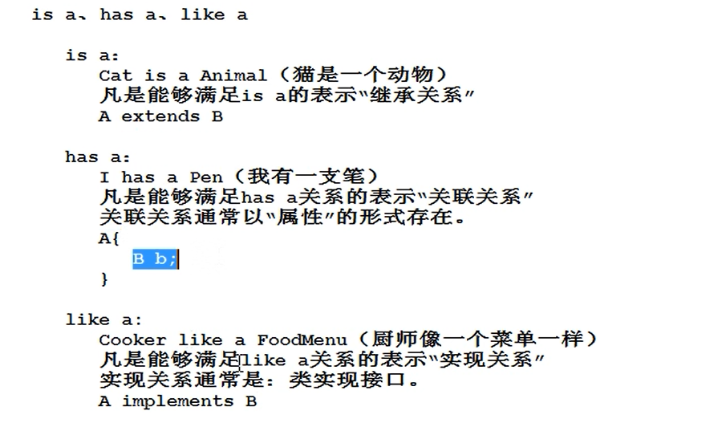

## 5 包

### package是一个关键字，后面加包名，只允许出现在java源代码第一行

包名命名规范：公司域名倒叙+项目名+模块名+功能名

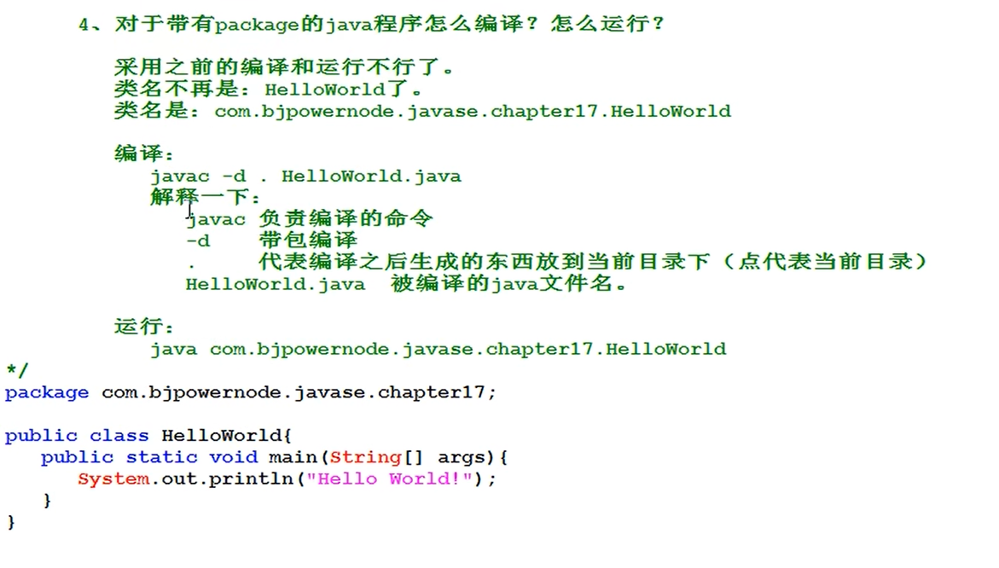

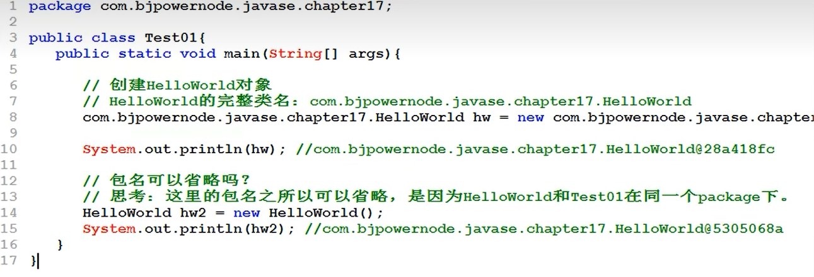

不在同一个包下包名不能省略

### import

什么时候用？

A类B类都在同一个包下，不需要import

A类B类不在同一个包下，需要import

怎么用？

只能出现在package语句之下，class声明语句之上

采用*方式

lang包不需要手动导入

```java
import java.util.Scanner;
import java.util.*;
```

## 6 访问权限

| 访问控制修饰符 | 本类 | 同包 | 子类 | 任意位置 |
| :------------: | :--: | :--: | :--: | -------- |
| private        | √ | × | × | × |
| 默认           | √ | √ | × | × |
| protected      | √ | √ | √ | × |
| public         | √ | √ | √ | √ |

## 7 Object

### toString

### equals

```java
public boolean equals(Object obj) {
    return (this == obj);
}
```

判断基本数据相等 ==

判断两个java对象是否相等 双等号只会判断变量保存的内存地址是否相等，使用重写的equals

比较字符串必须调用equals方法，String类已经重写了equals方法

String类重写了toString方法

java中所有引用数据类型统一使用eauals方法判断是否相等

```java
@Override
    public boolean equals(Object o) {
        if (this == o) return true;
        if (o == null || getClass() != o.getClass()) return false;
        MyDate myDate = (MyDate) o;
        return year == myDate.year && month == myDate.month && day == myDate.day;
    }
```

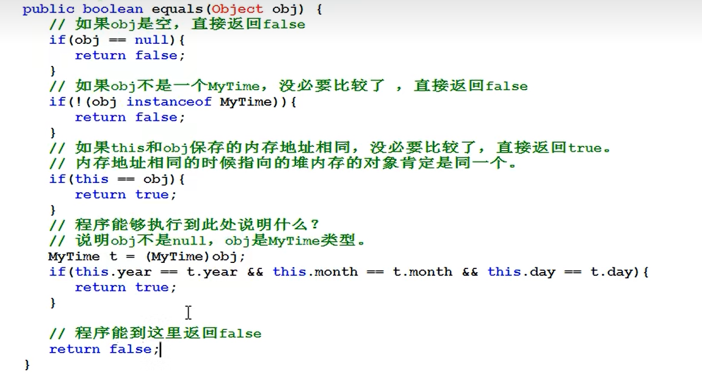

### finalize

```java
protected void finalize()  throws  Throwable {}
```

finalize()方法只有一个方法体，里面没有代码，而且这个方法是protected修饰的

垃圾销毁时机，只需要重写，程序会被自动调用

### hashCode()方法

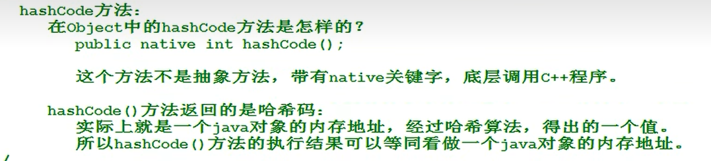

## 8 匿名内部类

```java
import java.util.Objects;
import java.util.Scanner;

public class Test {
    public static void main(String[] args) {
        //普通实现
        MyMath m = new MyMath();
        m.mySum(new Compute11(),1,2);
        //使用匿名内部类
        m.mySum(new Compute() {
            @Override
            public int sum(int a, int b) {
                return a+b;
            }
        },1,1);
    }
}
interface Compute {
    int sum(int a,int b);
}
class Compute11 implements Compute{
    @Override
    public int sum(int a, int b) {
        return a+b;
    }
}
class MyMath {
    public void mySum(Compute c,int x,int y) {
        int retValue = c.sum(x,y);
        System.out.println(x + "+" + y + "=" + retValue);
    }
}
```

## 9 数组

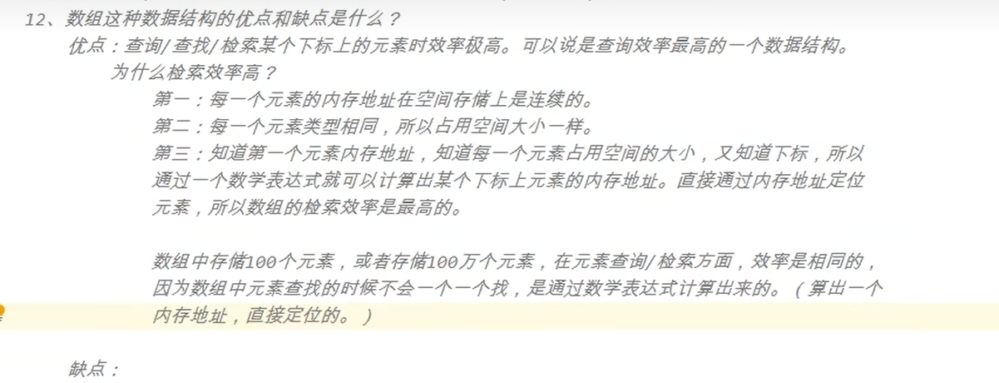

​	缺点：增删难，空间有限

### 声明和初始化

#### 声明：

int[] array;

double[] array;

### 初始化

静态初始化：int[] array = {100,200,300};

动态初始化:  int[] arry = new int[5];

数组扩容

```java
package com.javase.arry;
//数组扩容
public class ArrayTest04 {
    public static void main(String[] args) {
        int[] src = {1,2,3,4,5};
        int[] dest = new int[20];
        //源数组，源起始位置，目标数组，目标起始位置，长度
        System.arraycopy(src,0,dest,0,5);
    }
}
```

### 二维数组

```java
package com.javase.arry;

public class ArrayTest05 {
    public static void main(String[] args) {
        int [][] a = {{1,2,3},{4,5,6},{7,8,9}};
        System.out.println(a.length);
        for (int i = 0; i < a.length; i++) {
            for (int j = 0; j < a[i].length; j++) {
                System.out.print(a[i][j]);
            }
            System.out.println();
        }
    }
}
```

数组模拟栈

```java
package com.javase.arry;
//数组模拟栈数据结构
public class ArrayStack {
    public static void main(String[] args) {
        MyStack ms = new MyStack();
        ms.push(2);
        ms.push(3);
        ms.push(6);
        ms.push(7);
        ms.print();
        ms.pop();
        ms.print();
    }
}
class MyStack {
    private Object[] elements;  //存储栈内任何引用型数据类型
    private int index = 0;
    public MyStack() {
        elements = new Object[10];
    }
    public MyStack(Object[] elements) {
        this.elements = elements;
    }

    public void push(Object o) {    //压栈操作
        if (index >= 50) {
            System.out.println("非法，栈满了！！");
            return;
        }
        else {
            elements[index] = o;
            System.out.println("元素"+elements[index]+"被压入栈了");
            ++index;
        }
    }
    public Object pop() {   //弹栈操作
        if (elements.length == 0) {
            System.out.println("空栈，非法！！！");
            return null;
        }
        else {
            --index;
            System.out.println("元素"+elements[index]+"被弹出栈了");
            return elements[index];
        }
    }
    public void print() {   //打印栈元素
        if (elements.length == 0) {
            System.out.println("空栈！");
            return ;
        }
        else {
            System.out.println("由栈顶到栈底输出元素：");
            for (int i = index-1; i >= 0; i--) {
                System.out.print(elements[i]+" ");
                System.out.println();
            }
        }
    }

    public Object[] getElements() {
        return elements;
    }

    public void setElements(Object[] elements) {
        this.elements = elements;
    }

    public int getIndex() {
        return index;
    }

    public void setIndex(int index) {
        this.index = index;
    }
}
```

冒泡排序

```java
package com.javase.arry;
//冒泡排序
public class BubbleSort {
    public static void main(String[] args) {
        int[] arr = {3,4,8,11,1,2};
        for (int i = arr.length; i > 0 ; i--) {
            for (int j = 0; j < arr.length-1; j++) {
                if (arr[j] > arr[j+1]) {
                    int temp;
                    temp = arr[j];
                    arr[j] = arr[j+1];
                    arr[j+1] = temp;
                }
            }
        }
        for (int i = 0; i < arr.length; i++) {
            System.out.println(arr[i]);
        }
    }
}
```

```java
package com.javase.arry;
//选择排序
public class SelectSort {
    public static void main(String[] args) {
        int[] arr = {3,4,8,11,1,2};
        for (int i = 0; i < arr.length-1; i++) {
            int min = arr[i];
            int flag = i;
            for (int j = i+1; j < arr.length; j++) {
                if(min > arr[j]) {
                    min = arr[j];
                    flag = j;
                }
            }
            if(flag != i) {
                int temp = arr[i];
                arr[i] = arr[flag];
                arr[flag] = temp;
            }
        }
        for (int i = 0; i < arr.length; i++) {
            System.out.println(arr[i]);
        }
    }
}
```

二分查找

```java
package com.javase.arry;
import java.util.Arrays;
//二分查找
public class BiSearch {
    public static void main(String[] args) {
        int[] arr = {3,4,8,11,1,2};
        Arrays.sort(arr);
        int index = biSearch(arr,8);
        System.out.println(index);
    }
    public static int biSearch(int []arr,int number) {
        int begin = 0;
        int end = arr.length - 1;
        while (begin <= end) {
            int mid = (begin + end) / 2;
            if (arr[mid] == number) {
                return mid;
            } else if (arr[mid] > number) {
                end = mid - 1;
            } else if (arr[mid] < number) {
                begin = mid + 1;
            }
        }

        return -1;
    }
}
```

### 使用arrays类

封装的排序，二分查找

## 10 常用类

### String

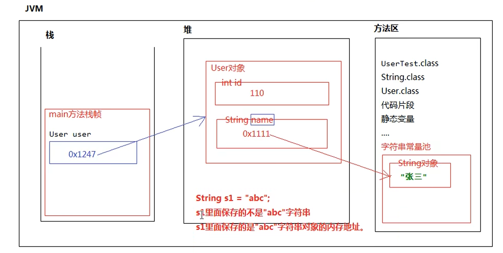

```java
package com.javase.stringtest;

public class StringTest01 {
    public static void main(String[] args) {
        String s1 = "abc";
        String s2 = "abc";
        System.out.println(s1 == s2);   //true
        String x = new String("abc");
        String y = new String("abc");
        System.out.println(x == y); //false
        System.out.println(x.equals(y));    //true,String类已经重写了equals类
    }
}

```

面试题

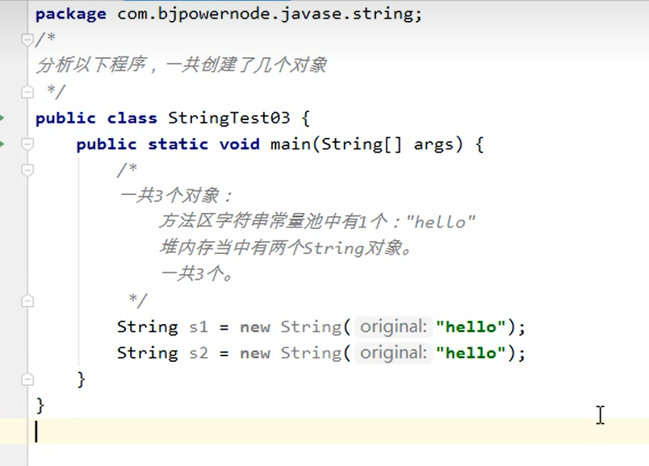

#### 常用构造方法

```java
package com.javase.stringtest;

public class StringTest02 {
    public static void main(String[] args) {
        byte[] b = {97,98,99};
        String s = new String(b);
        System.out.println(s);
        //将数组中一部分转换成字符串,起始位置，长度
        String s3 = new String(b,1,2);
        System.out.println(s3);
    }
}
```

String方法

帮助文档

```java
package com.javase.stringtest;

public class StringTest03 {
    public static void main(String[] args) {
        //charAt
        char c = "中国人".charAt(1);
        System.out.println(c);
        //compareTo,前小后大-1，前大后小1，相等0
        int result = "abc".compareTo("abc");
        System.out.println(result);
        //contains判断前面字符串是否包含后面的字符串
        System.out.println("123".contains("12"));
        //split 拆分字符串
        String[] ymd = "1980-10-11".split("-");
        for (int i = 0; i < ymd.length; i++) {
            System.out.println(ymd[i]);
        }
        //sunString截取字符串
        //toCharArray将字符串转换成char数组
        char[] cha = "我是中国人".toCharArray();
        for (int i = 0; i < cha.length; i++) {
            System.out.println(cha[i]);
        }
    }
}
```

### StringBuffer

使用大量字符串拼接使用该方法

```
stringBuffer 是线程安全的
stringBuilder是线程不安全的
```

### 8种包装类

| 基本数据类型 | 包装类型          |
| ------------ | ----------------- |
| byte         | java.lang.Byte    |
| short        | java.lang.Short   |
| int          | java.lang.Integer |
| long         | java.lang.Long    |
| float        | java.lang.Float   |
| double       | java.lang.Double  |
| boolen       | java.lang.Boolen  |
| char         | java.lang.Char    |

#### 拆箱装箱

```
package com.javase.integer;

public class IntegerTest01 {
    public static void main(String[] args) {
        //基本数据类型 -(转换为)-》引用数据类型（装箱）
        Integer i = new Integer(123);
        //引用类型->基本数据类型（拆箱）
        int r = i.intValue();
        System.out.println(r);
        Integer x = 100;//自动装箱
        int y = x;//自动拆箱
    }
}
```


